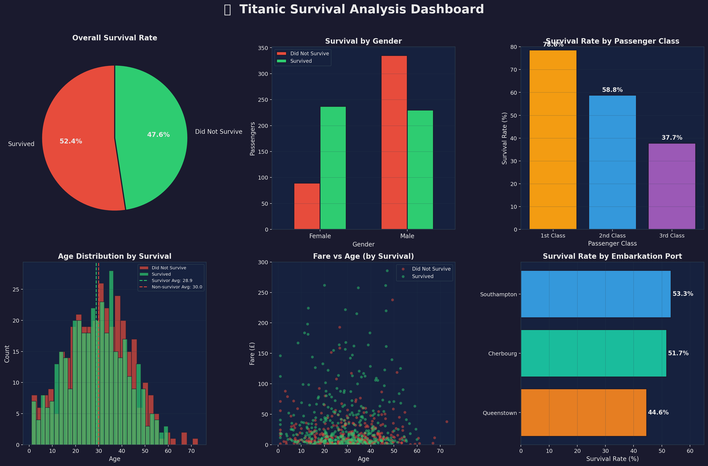

# 📉 Task 3 — Data Visualization


> **CodeAlpha Data Analytics Internship — Task 3**

---

## 📌 Objective

Transform raw Titanic data into a **professional 6-panel visualization dashboard** that:
- Communicates survival patterns clearly and visually
- Uses multiple chart types (pie, bar, histogram, scatter, horizontal bar)
- Tells a compelling data story supporting decision-making
- Demonstrates proficiency in Matplotlib and Seaborn

---

## 📂 Files

| File | Description |
|---|---|
| `task3_visualization.py` | Main Python visualization script |
| `titanic.csv` | Titanic passenger dataset |
| `titanic_dashboard.png` | Generated dashboard output |
| `README.md` | Task documentation |

---

## 📊 Dashboard Panels

| Panel | Chart Type | Insight |
|---|---|---|
| 1. Overall Survival | Pie Chart | ~52% survived |
| 2. Survival by Gender | Grouped Bar | Women survived far more |
| 3. Survival by Class | Bar Chart | 1st class had highest rate |
| 4. Age Distribution | Histogram | Younger passengers fared better |
| 5. Fare vs Age | Scatter Plot | Higher fare = higher survival |
| 6. Survival by Port | Horizontal Bar | Cherbourg had highest rate |

---

## 🎨 Design Choices

- **Dark theme** (`#1A1A2E` background) for professional, modern look
- **Red (#E74C3C)** for non-survivors, **Green (#2ECC71)** for survivors — intuitive color coding
- Consistent typography and grid styling across all panels
- High-resolution export (180 DPI) suitable for reports and LinkedIn

---

## ⚙️ How to Run

```bash
# Install dependencies
pip install pandas numpy matplotlib seaborn

# Run the visualization script
python task3_visualization.py
```

The script will:
1. Load and clean the dataset
2. Generate all 6 charts
3. Save the dashboard as `titanic_dashboard.png`

---

## 🖼️ Dashboard Preview



---

## 📈 Visual Insights

- **52%** of passengers survived overall
- **Female** survival (~73%) was nearly **2× higher** than male (~41%)
- **1st class** passengers had a **78.6%** survival rate vs **37.7%** in 3rd class
- Passengers paying **higher fares** had noticeably better survival odds
- **Cherbourg** embarkation had the highest survival rate (~55%)

---

> 📁 Part of [CodeAlpha_DataAnalytics](../README.md) repository
